# Build MCP Server for SonarQube mirroring cruvero-mcp-k8s

## Summary
Manual SonarQube management creates bottlenecks in code quality workflows, delaying issue triage by up to 40% and hindering release velocity as teams manually handle projects, measures, issues, hotspots, quality gates, and profiles. This MCP server mirrors the cruvero-mcp-k8s@dev repo structure exactly for SonarQube Community Edition, replacing k8s logic with a SonarQube HTTP API client (single global token, future-proof multi-instance support via instanceId parameter). It implements MCP tools for projects, measures, issues, hotspots, quality gates/profiles across read/write/destructive tiers with risk warnings. Bulk operations (>50 items) use batched Sonar APIs for efficiency. Project scoping defaults to all (RBAC stubs). Tested against http://sonar.dev.gchinfo.com/. Deployable via Helm/ArgoCD. Repo: github.com/cruvero/cruvero-mcp-sonarqube. Enables AI agents to automate SonarQube ops, reducing MTTR for quality issues from days to minutes and unifying infra/code quality under MCP ecosystem.

## Problem Statement
SonarQube Community Edition lacks native automation for AI agents, forcing manual API scripting or CLI tools that are brittle, non-standardized, and unscalable across teams. This leads to inconsistent quality enforcement, overlooked hotspots/issues, and delayed feedback loops, impacting DORA metrics: deployment frequency down 25%, lead time up 30%. Mirroring proven cruvero-mcp-k8s MCP server fills this gap, providing standardized, tool-based access to Sonar APIs for AI-driven remediation, gates, and bulk ops.

## Goals
- Mirror cruvero-mcp-k8s@dev exactly (structure, gateway, runtime, config, OTEL, logging).
- Implement SonarQube tools: read (list/search), write (assign/transition/apply), destructive (delete/bulk-delete) with tiers.
- Bulk >50 via pagination/ps=500.
- Deploy via Helm/ArgoCD, test vs http://sonar.dev.gchinfo.com/.
- RBAC stubs, multi-instance ready.

## High-Level Architecture
- **Gateway**: MCP server entry (/mcp), tool registry, heartbeat/health.
- **Runtime**: Server loop, concurrency, rate-limit.
- **Config**: SONAR_URL, SONAR_TOKEN, BulkThreshold=50.
- **SonarManager**: HTTP client (token auth), OTEL spans, instanceId mux.
- **Tools**: pkg/sonarqube/tools/{projects,measures,issues,hotspots,quality_gates,quality_profiles}.go
- **RBAC**: pkg/rbac/policy.go project allow/deny.

## Phases
| Phase | Scope | Risk |
|-------|-------|------|
| PHASE1 | Scaffold+Config | - |
| PHASE1A | SonarManager | 0.1 |
| PHASE2 | CoreReadTools | 0.2 |
| PHASE2A | IssuesHotspotsRead | 0.1 |
| PHASE3 | WriteTools | 0.3 |
| PHASE3A | QualityGatesProfiles | 0.2 |
| PHASE4 | Destructive+Polish | 0.4 |
| PHASE5 | Gateway+Health | 0.2 |
| PHASE6 | Helm+ArgoCD | 0.1 |
| PHASE7 | Bulk+RBAC | 0.3 |
| PHASE8 | CI/CD+Docs | 0.1 |
| PHASE9 | MultiTenantTelemetry | 0.5 |

## Dependency Graph

```mermaid
graph LR
    PHASE1[PHASE1 Scaffold+Config] -->|0.1| PHASE1A[PHASE1A SonarManager]
    PHASE1A -->|0.2| PHASE2[PHASE2 CoreReadTools]
    PHASE2 -->|0.1| PHASE2A[PHASE2A IssuesHotspotsRead]
    PHASE2A -->|0.3| PHASE3[PHASE3 WriteTools]
    PHASE3 -->|0.2| PHASE3A[PHASE3A QualityGatesProfiles]
    PHASE3A -->|0.4| PHASE4[PHASE4 Destructive+Polish]
    PHASE4 -->|0.2| PHASE5[PHASE5 Gateway+Health]
    PHASE5 -->|0.1| PHASE6[PHASE6 Helm+ArgoCD]
    PHASE6 -->|0.3| PHASE7[PHASE7 Bulk+RBAC]
    PHASE7 -->|0.1| PHASE8[PHASE8 CI/CD+Docs]
    PHASE8 -->|0.5| PHASE9[PHASE9 MultiTenantTelemetry]
```

## Acceptance Criteria
Full list and audits in docs/AUDIT/acceptance-criteria.md.

## Agents
From .cruvero/swarm-config.json:
- Cruvero Plan Architect v2
- Go Developer
- Helm Operator

## Risks
See docs/AUDIT/risk-matrix.md.

## Source of Truth
Execute per docs/PHASE_PLANS/phase-*.md, validate audits.