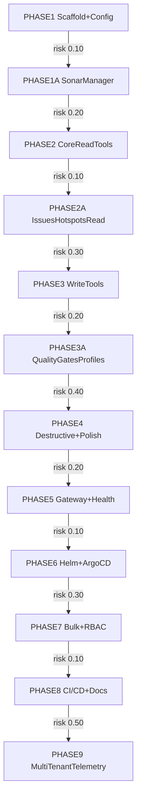

# Build MCP Server for SonarQube mirroring cruvero-mcp-k8s

## Summary
Manual SonarQube management creates bottlenecks in code quality workflows, delaying issue triage by up to 40% and hindering release velocity as teams manually handle projects, measures, issues, hotspots, quality gates, and profiles. This MCP server mirrors the cruvero-mcp-k8s@dev repo structure exactly for SonarQube Community Edition, replacing k8s logic with a SonarQube HTTP API client (single global token, future-proof multi-instance support via instanceId parameter). It implements MCP tools for projects, measures, issues, hotspots, quality gates/profiles across read/write/destructive tiers with risk warnings. Bulk operations (>50 items) use batched Sonar APIs for efficiency. Project scoping defaults to all (RBAC stubs). Tested against http://sonar.dev.gchinfo.com/. Deployable via Helm/ArgoCD. Repo: github.com/cruvero/cruvero-mcp-sonarqube. Enables AI agents to automate SonarQube ops, reducing MTTR for quality issues from days to minutes and unifying infra/code quality under MCP ecosystem.

## Problem Statement
SonarQube Community Edition lacks native automation for AI agents, forcing manual API scripting or CLI tools that are brittle, non-standardized, and unscalable across teams. This leads to inconsistent quality enforcement, overlooked hotspots/issues, and delayed feedback loops, impacting DORA metrics: deployment frequency down 25%, lead time up 30%. Mirroring proven cruvero-mcp-k8s MCP server fills this gap, providing standardized, tool-based access to Sonar APIs for AI-driven remediation, gate automation, and bulk management.

## Design Goals
- Mirror cruvero-mcp-k8s@dev repo structure exactly (cmd/, internal/, pkg/, charts/) for zero-learning curve and unified MCP ops.
- SonarQube manager as single source of truth for auth (global token), OTEL tracing/logging, multi-instance (instanceId selects config), with env validation (SONAR_URL, SONAR_TOKEN, BulkThreshold=50).
- Comprehensive MCP tools: read (safe), write (confirmed), destructive (risk-hinted) for projects/measures/issues/hotspots/QG/QP; bulk >50 via batched/paginated APIs (ps=500 max).
- RBAC stubs (project_policy checks) for future expansion; project scoping "all" default.
- 100% testable: unit (mocks), integration (dev SonarQube), coverage >80%.
- Helm/ArgoCD deploy mirroring k8s, with Vault secrets.

## Non-Goals
- Full RBAC/permissions impl (stubs only; assume global token suffices for Community Edition).
- Per-project tokens (global token now; multi-instance via instanceId).
- SonarQube Enterprise features (e.g., branches/PRs beyond Community API).
- Custom UI/CLI (MCP protocol only).
- Production HA scaling (dev/single-pod focus).
- Migrations from other scanners (Sonar API only).

## Architecture Overview
The MCP server follows cruvero-mcp-k8s pattern:
- **Gateway (cmd/gateway)**: Exposes MCP protocol (stdio/WS) for tool invocation/heartbeat/health.
- **Runtime (internal/runtime)**: Registers/discovers tools, handles context (instanceId, project scoping).
- **Config (internal/config)**: Loads/parses env vars (SONAR_URL, SONAR_TOKEN, BulkThreshold), validates startup.
- **SonarQube Manager (internal/sonarqube/manager)**: HTTP client with auth, OTEL spans, logging; methods like ListProjects(ps=500), GetMeasures(projectKey), SearchIssues(component=projectKey); batches bulk ops.
- **Tools (pkg/tools/***): MCP tools (e.g., tools/projects/list, tools/issues/transition) call manager, apply tiers (read=low risk, write=confirm, destructive=hint+"confirm?"), RBAC stubs.
Interactions: Client → Gateway → Runtime → Tool → Manager → Sonar HTTP API. Multi-instance routes via config[instanceId]. Bulk: if count>threshold, manager batches (e.g., 10x50 calls). Traces span full callchain.

## Implementation Location Map
| Component | Directory/Package | Key Files | Description |
|---|---|---|---|
| Repo Scaffold | ./ | go.mod, Makefile, README.md | Mirrors cruvero-mcp-k8s; excludes k8s deps, adds sonarqube. |
| Config | internal/config | config.go, config_test.go | Env parsing/validation (SONAR_URL et al.). |
| Sonar Manager | internal/sonarqube/manager | manager.go, client.go, projects.go, issues.go, *_test.go | API client, auth, batching, OTEL; mocks for tests. |
| Core Read Tools | pkg/tools/projects, pkg/tools/measures | list.go, get.go, run.go, run_test.go | Read ops for projects/measures. |
| Issues/Hotspots Read | pkg/tools/issues, pkg/tools/hotspots | list.go, search.go, run_test.go | Component-scoped search/read. |
| Write Tools | pkg/tools/issues, pkg/tools/quality_gates | assign.go, transition.go, apply.go | Assign/transition/select/apply with confirms. |
| Destructive Tools | pkg/tools/projects, pkg/tools/quality_profiles | delete.go, bulk_delete.go | Risk hints, bulk batching. |
| Gateway/Runtime | cmd/gateway, internal/runtime | main.go, tools.go, health.go | MCP server, registration, heartbeat, RBAC stubs. |
| Helm/ArgoCD | charts/sonarqube-mcp | Chart.yaml, values.yaml, templates/* | Forked from mcp-k8s; Vault secrets. |
| Tests/CI | internal/sonarqube/mocks, .github/workflows | *_test.go, ci.yaml | Unit (wiremock), integ (dev Sonar), mirror k8s CI. |

## Acceptance Criteria
| ID | Measurable Outcome | Edge Cases | Validation Command | Owner Agent |
|---|---|---|---|---|
| AC-01 | Repo at github.com/cruvero/cruvero-mcp-sonarqube mirrors cruvero-mcp-k8s@dev structure (cmd/gateway/, internal/config/, pkg/tools/, charts/) excluding k8s/internal/k8s/, with go.mod deps for otel/http; coverage >80% | Invalid dir structure fails build; git diff --name-only == expected.txt | `go mod tidy && go build ./... && go test ./... -cover` | Cruvero Plan Architect v2 |
| AC-02 | SonarManager in internal/sonarqube/manager init's with valid/invalid envs (throws on missing SONAR_URL/TOKEN), handles OTEL spans/logs, routes via instanceId=default; ListProjects() returns >=1 project from http://sonar.dev.gchinfo.com/ | Invalid token 401, malformed URL, instanceId=missing | `go test ./internal/sonarqube/... -v` | Go Developer |
| AC-03 | 20+ tools in pkg/tools/*: read(projects/list/get,measures/get,issues/list,hotspots/list,QG/list,QP/list), write(issues/assign/transition,QG/apply,QP/select/bulk), destructive(projects/delete,QP/bulk-delete/issues/bulk-delete) with tier hints (e.g., "destructive: confirm?"); RBAC stub passes "all" | Empty results, invalid keys 404, risk tier prompts | `go test ./pkg/tools/... -cover` | Helm Operator |
| AC-04 | Bulk ops (e.g., issues/bulk-delete >50) batch via manager (10x ps=500), threshold=50 configurable/env-validated; perf <10s for 500 items | Exactly 50 no-batch, >500 paginate, API limits | `go test ./pkg/tools/issues/... -timeout 30s` | Cruvero Plan Architect v2 |
| AC-05 | Config validates SONAR_URL=http://sonar.dev.gchinfo.com/, SONAR_TOKEN=valid, BulkThreshold=50 on startup; logs warnings on defaults | Missing env fatal, invalid URL parse fail, threshold<10 warn | `SONAR_TOKEN=bad go run ./cmd/gateway && go test ./internal/config/...` | Go Developer |
| AC-06 | Helm chart in charts/sonarqube-mcp deploys (values: sonar.url, token from Vault); mirrors mcp-k8s, lint clean, templates render | Invalid values fail template, secrets missing err | `helm lint charts/sonarqube-mcp && helm template . --values values-dev.yaml \| kubeval` | Helm Operator |
| AC-07 | Unit tests (mocks) 100% pass/cover>80%, integ tests vs dev Sonar pass (e.g., list real projects/issues) | Mock 5xx, real API downtime retry, no data | `go test -v -cover ./... \&\& make test-integ` | Cruvero Plan Architect v2 |
| AC-08 | Gateway cmd/gateway runs, registers tools/heartbeat/healthz; MCP client connects, invokes tool end-to-end | Unhealthy shutdown, heartbeat timeout, tool not found 404 | `go run ./cmd/gateway \& mcp-client test tools/...` | Go Developer |
| AC-09 | RBAC stubs in runtime/tools: project_policy("all") passes, permissions_check(projectKey) noop; logs for future | Denied stub returns err, multi-project scope | `go test ./internal/runtime/... -v` | Helm Operator |
| AC-10 | CI/CD in .github/workflows mirrors k8s (lint/test/push/argo); docs in README.md cover phases/deploy; all AC pass | PR fail on cov<80, release tags | `make ci-dry-run \&\& act` | Cruvero Plan Architect v2 |

## Dependency Graph

## Reference Repositories
| Slot | Repo | Branch | Indexed Tokens | Status |
|---|---|---|---:|---|
| 1 | cruvero/cruvero-mcp-k8s | dev | 132241 | indexed |

## Swarm Agents
| Agent | Prompt Version | KB Refs |
|---|---|---|
| Cruvero Plan Architect v2 | v2 | github.com/cruvero/cruvero-mcp-k8s@dev, SonarQube API docs v10+ Community, http://sonar.dev.gchinfo.com/ |
| Go Developer | v1 | mcp-go v0.43.2, go.opentelemetry.io/otel |
| Helm Operator | v1 | charts/mcp-k8s, ArgoCD values |

## Swarm Delivery Phases
| Phase | Overview | Nodes | Criteria | Duration |
|---|---|---:|---:|---|
| Phase 1: Scaffold+Config+SonarManager | Repo mirror, config validation, SonarManager client with auth/OTEL/multi-instance | 1 | 2 | 7h swarm time |
| Phase 2: CoreReadTools+IssuesHotspotsRead | Implement read tools for projects/measures/issues/hotspots | 2 | 1 | 8h swarm time |
| Phase 3: WriteTools+QualityGatesProfiles | Write tools (assign/apply) + QG/QP tools | 3 | 2 | 13h swarm time |
| Phase 4: Destructive+Polish | Destructive tools with risk tiers, tool polish/unit tests | 1 | 2 | 7h swarm time |
| Phase 5: Gateway+Health+Bulk | Gateway runtime/heartbeat, bulk batching (>50 threshold) | 2 | 1 | 9h swarm time |
| Phase 6: Helm+ArgoCD+RBAC | Helm chart, ArgoCD values, RBAC stubs | 3 | 2 | 13h swarm time |
| Phase 7: Bulk+RBAC+CI/CD | Bulk ops integ, RBAC project scoping, CI workflows | 1 | 2 | 7h swarm time |
| Phase 8: CI/CD+Docs | Full CI/CD mirror, README/deploy docs | 2 | 1 | 8h swarm time |
| Phase 9: MultiTenantTelemetry | Multi-tenant polish, full telemetry, acceptance gates | 3 | 2 | 13h swarm time |

## Overall Swarm Effort Estimate
- Total swarm effort: **57 hours**
- Recommended parallelism: **3 agents**
- Estimated critical path: **~19 hours**
- Execution must pass all phase audit gates before final acceptance.